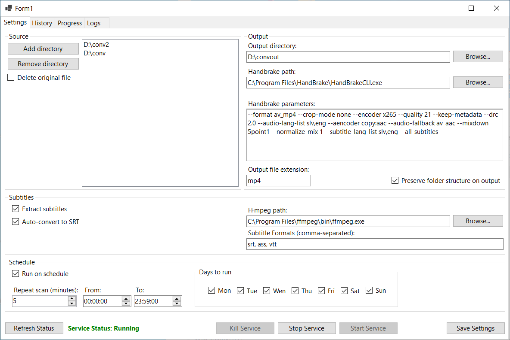
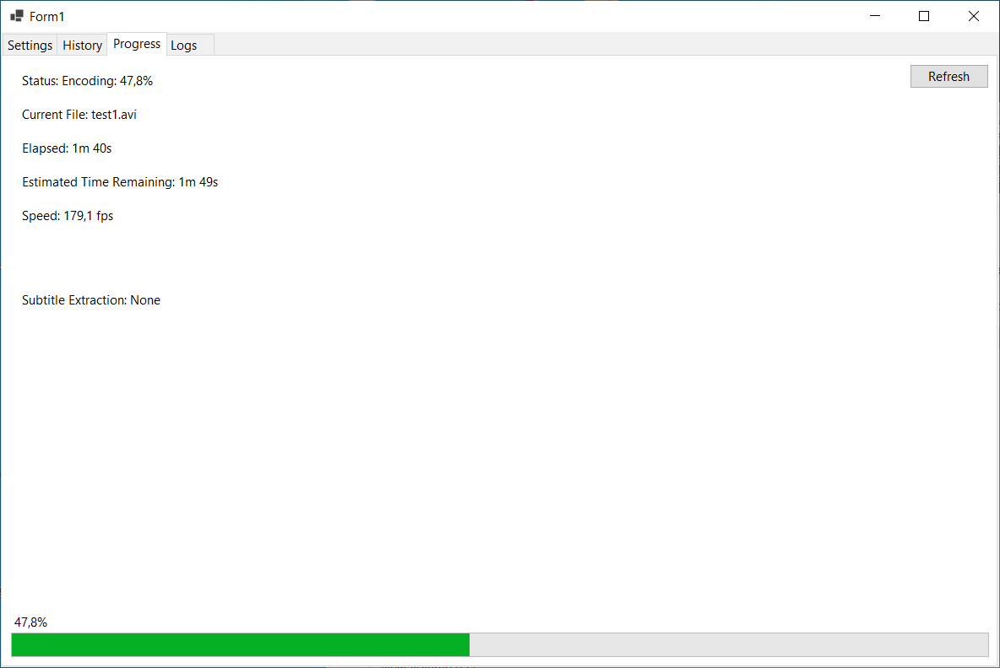
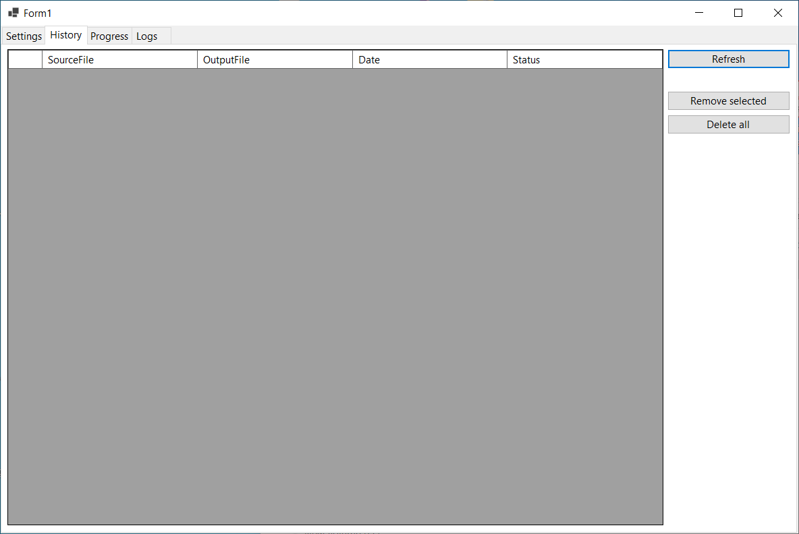
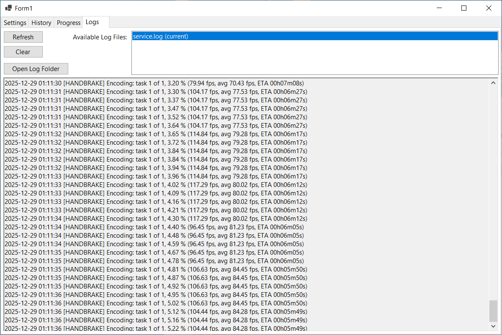

# Video Transcoder Service

<p align="center">      </p>

> 🎬 **Automated video transcoding service for Windows** - Schedule bulk video conversions with HandBrake and extract subtitles with FFmpeg, all running as a background Windows service.

## Overview

Video Transcoder Service is a Windows application that automatically transcodes video files on a schedule. It monitors specified directories, transcodes videos using HandBrake, and optionally extracts subtitles using FFmpeg - all while running silently in the background as a Windows service.

**Key Features:**

-   **Scheduled Processing** 🕐 - Define time windows and specific days for transcoding
-   **Folder Monitoring** 📁 - Automatically processes videos in monitored directories
-   **Smart History** 🎯 - Never transcodes the same file twice
-   **Subtitle Extraction** 📝 - Extract and convert subtitles to SRT format
-   **Real-time Progress** 📊 - Track transcoding progress with detailed statistics
-   **Flexible Configuration** 🔧 - Custom HandBrake parameters for any workflow
-   **Automatic Logging** 💾  - Comprehensive logs with automatic rotation

## Screenshots

### Settings Configuration

Configure directories, HandBrake parameters, and scheduling:



### Real-time Progress Tracking

Monitor transcoding progress with live updates:



### History Management

View and manage transcoded files:



### Service Logs

Browse detailed logs from HandBrake and FFmpeg:



## Installation

### Prerequisites

-   **Windows 10/11** (64-bit)
-   **.NET 10.0 Runtime** or later
-   **HandBrake CLI** - [Download](https://handbrake.fr/downloads2.php)
-   **FFmpeg** (optional, for subtitle extraction) - [Download](https://ffmpeg.org/download.html)

### Installation Steps

1.  **Download the latest installer** from [Releases](https://github.com/anzeumek/VideoTranscoderUtility/releases)
    
2.  **Run `VideoTranscoderSetup.exe`** as Administrator
    
3.  **Follow the installation wizard** - it will:
    
    -   Install the GUI application
    -   Install and start the Windows service
    -   Create necessary directories
4.  **Launch Video Transcoder** from Start Menu
    
5.  **Configure settings:**
    
    -   Add directories to monitor
    -   Set output directory
    -   Configure HandBrake and FFmpeg paths
    -   Set your transcoding schedule

### Manual Installation (Advanced)

```bash
# Clone repository
git clone https://github.com/anzeumek/VideoTranscoderUtility.git
cd VideoTranscoderUtility

# Open in Visual Studio 2026+
# Build solution in Release mode
# Install service manually:
sc create VideoTranscoderService binPath="C:\Path\To\VideoTranscoder.Service.exe" start=auto
sc start VideoTranscoderService

```
## Usage

### Quick Start

1.  **Add Monitored Directories**
    
    -   Open the Settings tab
    -   Click "Add Directory"
    -   Select folders containing videos to transcode
2.  **Configure Output**
    
    -   Set output directory where transcoded files will be saved
    -   Original folder structure is preserved
3.  **Set HandBrake Parameters**
    
    -   Use any HandBrake CLI parameters you need
    -   Example: `--encoder x265 --quality 22 --all-audio --all-subtitles`
4.  **Configure Schedule**
    
    -   Set start and end times (e.g., 10 PM to 6 AM)
    -   Select which days to run
    -   Service only transcodes during scheduled windows
5.  **Save Settings** and let the service work!
    

### Scheduling Examples

**Weeknight Processing:**

-   Days: Mon, Tue, Wed, Thu, Fri
-   Time: 10:00 PM - 6:00 AM
-   Use Case: Process videos while you sleep on work nights

**Weekend Only:**

-   Days: Sat, Sun
-   Time: 12:00 AM - 11:59 PM
-   Use Case: All-day processing on weekends

**Custom Schedule:**

-   Days: Tue, Thu, Sat
-   Time: 2:00 AM - 5:00 AM
-   Use Case: Specific nights with lighter workloads

### HandBrake Parameter Examples

```bash
# High quality H.265 encode
--encoder x265 --quality 22 --all-audio --all-subtitles

# Fast 1080p encode
--preset "Very Fast 1080p30" --encoder x264

# Preserve quality with specific codec
--encoder x265 --vb 2500 --audio-copy-mask aac,ac3

# Mobile-optimized output
--preset "Android 1080p30" --optimize

```

## Features in Detail

### Automatic Subtitle Extraction

-   Extracts all subtitle tracks from video files
-   Automatically converts some non-SRT subtitles to SRT format
-   Prioritizes English subtitles for conversion
-   Subtitles saved in organized `subs/` folders

### Smart History Tracking

-   Remembers all transcoded files
-   Prevents duplicate transcoding
-   View complete history in GUI
-   Remove entries to re-transcode files

### Real-time Progress Monitoring

-   Live percentage and FPS display
-   Estimated time remaining
-   Current file being processed
-   Subtitle extraction progress

### Service Control

-   Start/Stop service from GUI
-   Stop current operation without stopping service
-   View service status in real-time
-   Automatic restart on system reboot

### Comprehensive Logging

-   All HandBrake output logged
-   All FFmpeg operations logged
-   Automatic log rotation at 10MB
-   Keeps last 5 log files
-   Browse logs directly in GUI

### Folder Structure Preservation

Input:

```
D:\Videos\
└── Movies\
    └── Action\
        └── Movie.mkv

```

Output:

```
E:\Transcoded\
└── Movies\
    └── Action\
        ├── Movie.mkv
        └── subs\
            ├── Movie.eng.srt
            └── Movie.spa.srt

```

## Configuration

All settings are stored in:

```
C:\ProgramData\VideoTranscoder\
├── settings.json        # Application settings
├── history.json         # Transcoding history
├── progress.json        # Current progress
├── service.log          # Current log
└── service_*.log        # Archived logs

```

### Settings File Example

```json
{
  "MonitoredDirectories": [
    "D:\\Videos\\Movies",
    "D:\\Videos\\TV Shows"
  ],
  "OutputDirectory": "E:\\Transcoded",
  "HandBrakePath": "C:\\Program Files\\HandBrake\\HandBrakeCLI.exe",
  "FFmpegPath": "C:\\Program Files\\ffmpeg\\bin\\ffmpeg.exe",
  "HandBrakeParameters": "--encoder x265 --quality 22",
  "RunOnSchedule": true,
  "ScheduleStartTime": "22:00:00",
  "ScheduleEndTime": "06:00:00",
  "RunOnMonday": true,
  "RunOnTuesday": true,
  "ExtractSubtitles": true,
  "SubtitleFormats": "srt, ass, vtt",
  "ConvertToSrtIfMissing": true,
  "DeleteOriginalAfterTranscode": false
}

```

## Architecture

The project consists of three main components:

```
VideoTranscoder/
├── VideoTranscoder.Shared/      # Shared models and utilities
│   ├── TranscoderSettings.cs    # Configuration model
│   ├── TranscodeHistory.cs      # History tracking
│   ├── TranscodeProgress.cs     # Progress reporting
│   └── ServiceControl.cs        # Service communication
├── VideoTranscoder.Service/     # Windows Service
│   ├── Worker.cs                # Main processing logic
│   └── Program.cs               # Service entry point
└── VideoTranscoder.GUI/         # Windows Forms GUI
    └── Form1.cs                 # Main interface

```

### How It Works

1.  **Service monitors** for scheduled time windows
2.  **Scans directories** for video files
3.  **Checks history** to skip already-transcoded files
4.  **Extracts subtitles** (if enabled) using FFmpeg
5.  **Transcodes video** using HandBrake with custom parameters
6.  **Updates history** and progress files
7.  **Logs everything** for debugging and monitoring

### Communication

The service and GUI communicate through shared JSON files:

-   Settings are reloaded by the service every scan
-   Progress is written by service, read by GUI every 2 seconds
-   No network communication required

## Building from Source

### Requirements

-   Visual Studio 2026 or later
-   .NET 10.0 SDK
-   Windows 10/11

### Build Steps

```bash
# Clone repository
git clone https://github.com/anzeumek/VideoTranscoderUtility.git
cd VideoTranscoderUtility

# Open solution
start VideoTranscoderUtility.slnx

# In Visual Studio:
# 1. Set build configuration to "Release"
# 2. Build → Rebuild Solution
# 3. Output will be in:
#    - VideoTranscoder.GUI\bin\Release\net10.0\
#    - VideoTranscoder.Service\bin\Release\net10.0\

```

### Creating Installer

1.  Install [Inno Setup](https://jrsoftware.org/isdl.php)
2.  Open `VideoTranscoderSetup.iss`
3.  Update paths if needed
4.  Build → Compile
5.  Installer will be in `Installer\VideoTranscoderSetup.exe`

## Troubleshooting

### Service Won't Start

-   Run as Administrator
-   Check Event Viewer for errors
-   Verify .NET Runtime is installed
-   Check service.log for details

### HandBrake Not Working

-   Verify HandBrake CLI is installed
-   Check path in Settings tab
-   Test HandBrakeCLI.exe from command line
-   Ensure proper permissions

### Subtitles Not Extracting

-   Install FFmpeg
-   Set correct FFmpeg path in Settings
-   Check that videos actually contain subtitles
-   Review logs for FFmpeg errors

### Progress Not Updating

-   Ensure service is running
-   Check that GUI has read access to `C:\ProgramData\VideoTranscoder\`
-   Verify timer is running (restart GUI)

### High CPU Usage

The service runs HandBrake at "Below Normal" priority by default to minimize system impact during transcoding.

## Performance Considerations

-   **CPU Usage**: HandBrake is CPU-intensive; schedule during off-hours
-   **Disk Space**: Ensure adequate space in output directory
-   **Network**: Service works offline; no internet required
-   **Memory**: ~200MB for service, ~50MB for GUI

## Contributing

This is a hobby project and may not be actively maintained. However, contributions are still welcome. Please feel free to submit a Pull Request.

1.  Fork the repository
2.  Create your feature branch (`git checkout -b feature/AmazingFeature`)
3.  Commit your changes (`git commit -m 'Add some AmazingFeature'`)
4.  Push to the branch (`git push origin feature/AmazingFeature`)
5.  Open a Pull Request

## License

This project is licensed under the MIT License.

## Acknowledgments

-   **HandBrake** - Powerful video transcoding engine
-   **FFmpeg** - Comprehensive multimedia framework
-   **Inno Setup** - Installer creation tool

###  Disclaimer
This application depends on third-party software to function correctly.
These tools are **not bundled** with this application. You must install them separately and ensure they are accessible via your system PATH or configured correctly for the application to detect them.

### Third-Party Software
All third-party tools are:
-   Owned and maintained by their respective author
-   Licensed under their own licenses
-   Used by this application **without modification**

This project does **not** redistribute, replace, or relicense any of these tools.


## Support

-   **Issues**: [GitHub Issues](https://github.com/anzeumek/VideoTranscoderUtility/issues)
-   **Discussions**: [GitHub Discussions](https://github.com/anzeumek/VideoTranscoderUtility/discussions)

----------

**Built with ❤️ for video enthusiasts who want hands-off bulk transcoding**